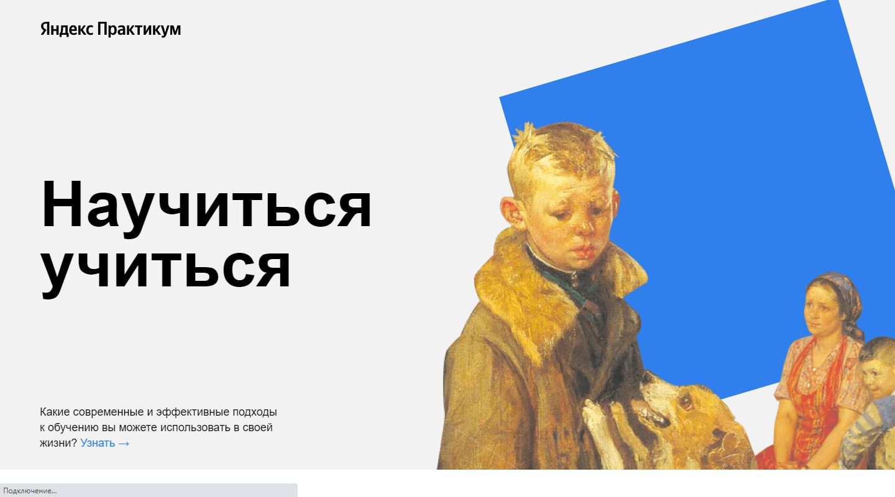

# Проект: Научиться учиться

Первый учебный проект в рамках курса "Веб-разработчик" от Яндекс Практикум, который призван, познакомить пользователей с различными современными подходами к обучению, доступными в любом возрасте. Также проект рассматривает основные проблемы связанные с обучением.

## Оглавление

- [Обзор проекта](#обзор-проекта)
  - [Задачи проекта](#задачи-проекта)
  - [Функциональность проекта](#функциональность-проекта)
  - [Screenshot](#screenshot)
  - [Директории проекта](#директории-проекта)
  - [Запуск проекта](#запуск-проекта)
  - [Ссылки](#ссылки)
- [Ход выполнения проекта](#ход-выполнения-проекта)
  - [Используемые технологии](#используемые-технологии)
  - [Чему я научился работая над проектом](#чему-я-научился-работая-над-проектом)
  - [Планы доработки проекта](#планы-доработки-проекта)
- [Автор](#автор)

## Обзор проекта

### Задачи проекта

Проект был призван изучить основы HTML, CSS, семантической вёрстки, и БЭМ.

### Функциональность проекта

Проект выполнен в виде лендинга состоящего из нескольких секций. В проекте реализованы различные подходы к позиционированию и выравниванию элементов, в том числе Flexbox и Grid Layout. Реализована анимация некоторых элементов страницы при помощи CSS.

### Screenshot

### Директории проекта

- `/blocks` — директория с CSS файлами
- `/images` — директория с файлами изображений
- `/pages` — директория с файлами страниц
- `/vendor` — директория с файлами библиотек

### Запуск проекта

Поскольку в проекте не используются сборщики или планировщики, то проект нужно просто клонировать и открыть index.html в браузере или с помощью LiveServer.

### Ссылки

- [Ссылка на репозиторий проекта](https://github.com/Bjorn86/how-to-learn)
- [Ссылка на демо-страницу проекта](https://bjorn86.github.io/how-to-learn/)

## Ход выполнения проекта

### Используемые технологии

- HTML
- CSS
- Семантическая вёрстка
- БЭМ, включая использование схемы файловой структуры Nested

### Чему я научился работая над проектом

- Позиционированию и выравниванию элементов страницы при помощи различных подходов
- Семантической вёрстке
- Анимации при помощи CSS
- Методологии БЭМ

### Планы доработки проекта

Основной проблемой данного учебного проекта являлось то, что в период учёбы проект был строго регламентирован брифами. Так, например, был запрет на создание дополнительных классов. Также поскольку этот проект был первым учебным проектом, не была предусмотрена его адаптация для мобильных устройств. Таким образом основной задачей доработки проекта стала его адаптация для мобильных устройства, а также добавление различного, вытекающего из структуры проекта, функционала, призванного продемонстрировать полученные навыки. Более подробно изменения сделанные после сдачи проекта описаны в файле [CHANGELOG.md](https://github.com/Bjorn86/how-to-learn/blob/main/CHANGELOG.md).

## Автор

**Данила Легкобытов**

- e-mail: [legkobytov-danila@yandex.ru](mailto:legkobytov-danila@yandex.ru)
- Telegram: [@danila_legkobytov](https://t.me/danila_legkobytov)
